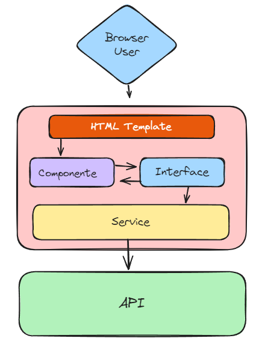

# Book Hive
Este projeto é uma aplicação web desenvolvida para facilitar o gerenciamento de livros. Ele permite que os usuários realizem operações completas de CRUD (Criar, Ler, Atualizar e Deletar) sobre um catálogo de livros de maneira simples e intuitiva.

## Resumo

- [Projeto](#projeto)
- [Arquitetura](#arquitetura)
- [Visão Geral](#visão-geral)

## Projeto
Este projeto foi desenvolvido com uma arquitetura modular e está dividido em duas partes principais: 
- [book-hive-app](https://github.com/oitom/book-hive-app) : SPA (Single Page Application) no front-end. 
  
  - SPA utilizando Angular 18, Bootstrap e Angular Material.

- [book-hive-api](https://github.com/oitom/book-hive-api) : API RESTful;

  - API utilizando PHP 8, Mysql, Redis e Docker;

Essa divisão proporciona uma estrutura escalável e de fácil manutenção, além de separar claramente as responsabilidades de cada camada.

## Arquitetura
API RESTful foi construída utilizando PHP e segue princípios sólidos de arquitetura e design, garantindo modularidade, manutenibilidade e escalabilidade.

## Arquitetura Front-end
O SPA Angular utiliza a arquitetura modular e escalável de aplicações web. 

Ela é composta por componentes, módulos, serviços e roteamento, promovendo a separação de preocupações:

### Estrutura Básica
- Componentes: 
  Cada componente representa uma parte da interface do usuário, encapsulando a lógica de apresentação e a template HTML.

- Módulos: 
  Os módulos organizam componentes, diretivas e serviços em unidades coesas, permitindo uma estrutura clara e reutilização.

## Arquitetura e Padrões de Projeto
A API adota a Arquitetura em Camadas (Layered Architecture), que organiza o código em diferentes camadas com responsabilidades distintas, facilitando o desenvolvimento e a manutenção da aplicação.

### Arquitetura em Camadas:
- **Presentation**: 
  Responsável pela interface de comunicação com os clientes da API, onde estão localizados os Controllers, Routers e Validators.
- **Application**: 
  Camada que contém a lógica de aplicação e orquestração de casos de uso, representada por Services, DTOs e Mappers.
- **Domain**: 
  Implementa o núcleo do sistema, focando nas regras de negócio. Aqui, estão definidas as Entities, Commands e os Repositories (interfaces).
- **Infrastructure**: 
  Contém a infraestrutura técnica necessária para rodar a aplicação, como persistência de dados através dos repositórios, definidos na camada de domínio, e implementados aqui.

### Padrões e Princípios Implementados:

- **Domain-Driven Design (DDD)**: 
  A API segue os conceitos de DDD, separando o núcleo de regras de negócio (Domain) das camadas de aplicação e infraestrutura. Isso facilita a manutenção das regras de negócios e sua evolução.

- **Separation of Concerns**: 
  A aplicação segue o princípio de Separação de Preocupações, onde cada camada tem uma responsabilidade bem definida. Isso garante que mudanças em uma parte da aplicação não impactem outras partes, promovendo manutenibilidade e evolução contínua.

- **Repository Pattern**: 
  O padrão Repository é utilizado para abstrair a lógica de persistência e acesso aos dados, desacoplando-a da lógica de negócios. Isso permite trocar a implementação de persistência sem alterar o comportamento da aplicação.

- **Controller-Service Pattern**: 
  Os Controllers recebem as requisições e delegam o processamento de negócios para os Services, garantindo uma separação clara entre a interface da API e a lógica de negócios.

- **Cache Aside Pattern**: 
  O Cache Aside Pattern (Cache ao Lado) é uma estratégia de gerenciamento de cache amplamente utilizada em aplicações para otimizar o desempenho de consultas a dados.

## Visão Geral

## Como contribuir

- Faça um fork do projeto
- Crie uma ramificação para seu recurso (git checkout -b feature/new-feature)
- Comprometa suas alterações (git commit -m 'Add new feature')
- Envie para a ramificação (git push origin feature/new-feature)
- Abra um Pull Request

